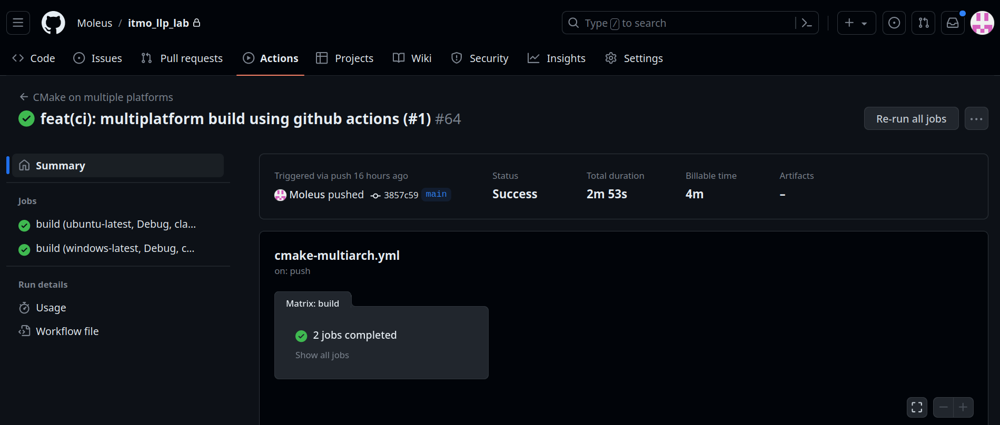

# Лабораторная работа 1. Реализация документного дерева

## Сборка
`cmake -G Ninja -S . -B build`
`cmake --build build`
## Запуск тестов
`cd ./build/test/ && ctest`

## Мультиплатформенная сборка с Github CI
